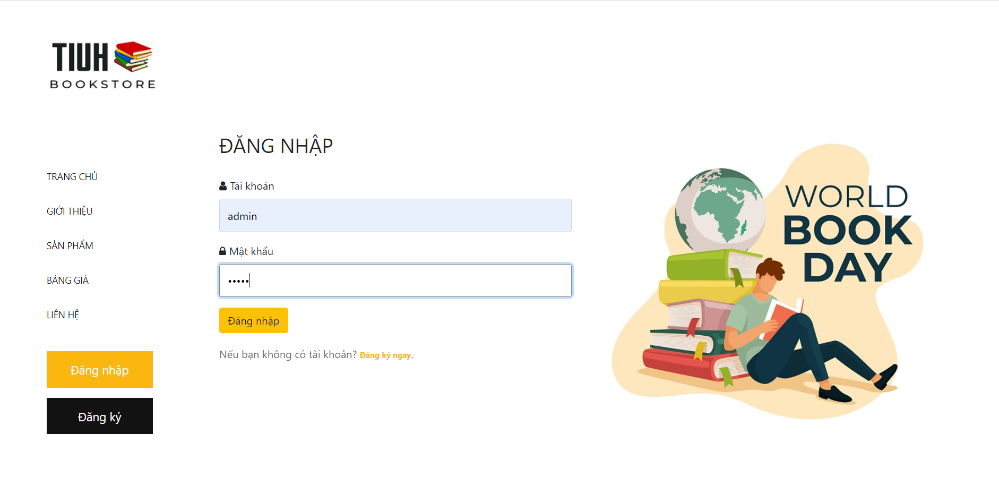

# TIUH Bookstore Online

> Website support user find books and pay it. UX/UI is comfortable for new users, and can register if they want to receive more news on sale.



Additional description about the project and its features.

## Built With

- Major languages: [PHP](https://www.php.net/)[Javascript]
- Frameworks: [Boostrap](https://getbootstrap.com/)[Fontawesome](https://fontawesome.com/)
- Technologies used

## Getting Started

**This is an example of how you may give instructions on setting up your project locally.**
**Modify this file to match your project, remove sections that don't apply. For example: delete the testing section if the currect project doesn't require testing.**


To get a local copy up and running follow these simple example steps.

### Clone the repository

```shell
git clone https://github.com/2dtrung/tiuh-bookstore.git
cd tiuh-bookstore
```

### Deployment
### Add heroku remotes

Using [Heroku CLI](https://devcenter.heroku.com/articles/heroku-cli):

```shell
heroku git:remote -a project
heroku git:remote --remote heroku-staging -a project-staging
```

## Server

```shell
rails s
```

## Deploy

### With Heroku pipeline (recommended)

Push to Heroku staging remote:

```shell
git push heroku-staging
```

Go to the Heroku Dashboard and [promote the app to production](https://devcenter.heroku.com/articles/pipelines) or use Heroku CLI:

```shell
heroku pipelines:promote -a project-staging
```

### Directly to production (not recommended)

Push to Heroku production remote:

```shell
git push heroku master
```

## Authors

👤 **Author1**

- GitHub: [@github](https://github.com/2dtrung)
- Twitter: [@twitter](https://twitter.com/2dtrung)
- LinkedIn: [LinkedIn](https://linkedin.com/in/2dtrung)

## 🤝 Contributing

Contributions, issues, and feature requests are welcome!

Feel free to check the [issues page](../../issues/).

## Acknowledgments

- Hat tip to anyone whose code was used
- Inspiration
- etc

## 📝 License

This project is [MIT](./MIT.md) licensed.
